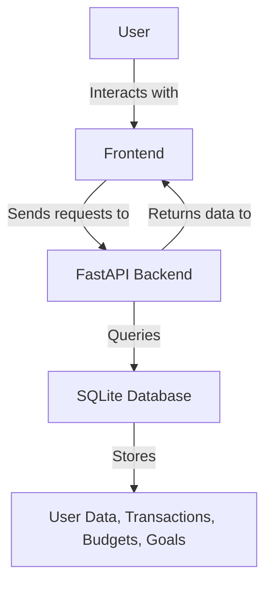

# AI-Driven Personal Finance Optimizer

## Overview
The AI-Driven Personal Finance Optimizer is a sophisticated application designed to help individuals manage their finances more effectively using AI-driven insights. By leveraging advanced algorithms and a user-friendly interface, this application provides personalized financial advice, helping users to optimize spending, set budgets, and achieve financial goals. Whether you're a financial novice or an experienced planner, this tool offers valuable insights tailored to your unique financial situation.

The application addresses common financial challenges such as overspending, inadequate budgeting, and lack of financial planning. Users can track transactions, set budgets, and define financial goals, all while receiving actionable insights to improve their financial health. This project is ideal for anyone looking to gain better control over their finances with the assistance of AI technology.

## Features
- **User Management**: Secure user registration and authentication with password hashing.
- **Budget Tracking**: Create and manage budgets by category, ensuring spending stays within limits.
- **Goal Setting**: Define financial goals with target amounts and deadlines to track progress.
- **Transaction Management**: Record and view transactions to monitor spending habits.
- **AI-Driven Insights**: Receive personalized advice to optimize financial decisions.
- **Responsive Design**: User-friendly interface with a responsive layout for various devices.
- **Data Persistence**: All data is stored in a local SQLite database for easy access and management.

## Tech Stack
| Technology  | Description                       |
|-------------|-----------------------------------|
| Python      | Core programming language        |
| FastAPI     | Web framework for building APIs  |
| Uvicorn     | ASGI server for running FastAPI  |
| SQLAlchemy  | ORM for database interactions    |
| Passlib     | Password hashing library         |
| Pydantic    | Data validation and settings     |
| HTML/CSS/JS | Frontend technologies            |

## Architecture
The project is structured to separate concerns between the frontend and backend. The backend, built with FastAPI, handles API requests and serves the frontend, which is composed of HTML, CSS, and JavaScript. The database models are defined using SQLAlchemy, and data flows from the user inputs on the frontend to the database through the API endpoints.



## Getting Started

### Prerequisites
- Python 3.11+
- pip (Python package manager)
- Docker (optional for containerized deployment)

### Installation
1. Clone the repository:
   ```bash
   git clone https://github.com/yourusername/ai-driven-personal-finance-optimizer-auto.git
   cd ai-driven-personal-finance-optimizer-auto
   ```
2. Create a virtual environment:
   ```bash
   python -m venv venv
   source venv/bin/activate  # On Windows use `venv\Scripts\activate`
   ```
3. Install the dependencies:
   ```bash
   pip install -r requirements.txt
   ```

### Running the Application
1. Start the FastAPI server:
   ```bash
   uvicorn app:app --reload
   ```
2. Open your web browser and visit `http://127.0.0.1:8000` to access the application.

## API Endpoints
| Method | Path              | Description                                      |
|--------|-------------------|--------------------------------------------------|
| GET    | `/`               | Returns the homepage HTML                        |
| POST   | `/api/budget`     | Creates a new budget                             |
| GET    | `/api/transactions` | Retrieves transactions for a specific user     |
| POST   | `/api/goals`      | Creates a new financial goal                     |
| GET    | `/api/insights`   | Provides AI-driven financial insights            |

## Project Structure
```
.
├── app.py                # Main application file
├── Dockerfile            # Docker configuration
├── requirements.txt      # Python dependencies
├── start.sh              # Shell script to start the application
├── static
│   ├── css
│   │   └── style.css     # Stylesheet for the application
│   └── js
│       └── main.js       # JavaScript for client-side interactions
└── templates
    └── index.html        # Main HTML template
```

## Screenshots
*Screenshots of the application interface will be added here.*

## Docker Deployment
1. Build the Docker image:
   ```bash
   docker build -t finance-optimizer .
   ```
2. Run the Docker container:
   ```bash
   docker run -d -p 8000:8000 finance-optimizer
   ```

## Contributing
Contributions are welcome! Please fork the repository and submit a pull request for any improvements or bug fixes.

## License
This project is licensed under the MIT License.

---
Built with Python and FastAPI.